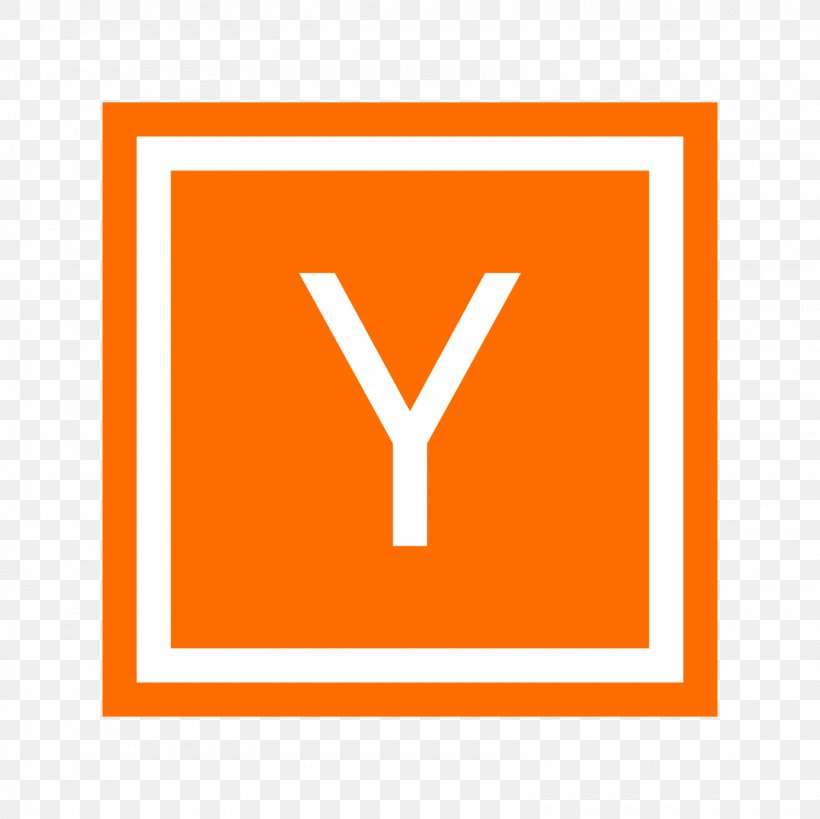
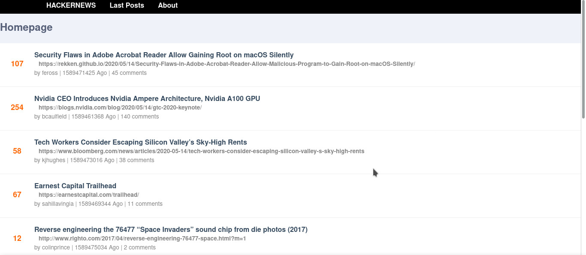
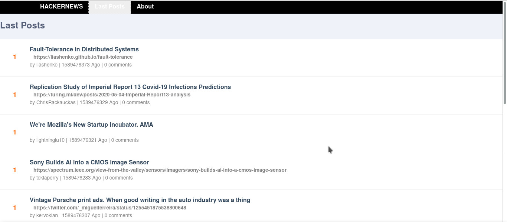
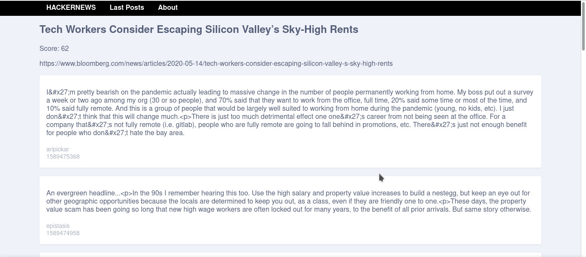

<h1 align="center">
<br>
  
<br>
<br>
HACKERNEWS-CLONE
</h1>

<p align="center">Simple clone of hackernews implemented for learning purposes.</p>

<p align="center">
  <a href="https://opensource.org/licenses/MIT">
    
  </a>
</p>

[//]: # (Add your gifs/images here:)
<div align="center">
    
    
    
</div>

<hr />

## Features
[//]: # (Add the features of your project here:)
this project uses vuejs in conjunction with other technologies to provide a good experience using a SPA.
- **Vue js** — A JavaScript library for building user interfaces
- **Axios** — A a library that proves the possibility of creating http requests to other applications or services

## Getting started

#### Project setup
```
yarn install
```

#### Compiles and hot-reloads for development
```
yarn run serve
```

#### Compiles and minifies for production
```
yarn run build
```

## License

This project is licensed under the MIT License - see the [LICENSE](https://opensource.org/licenses/MIT) page for details.